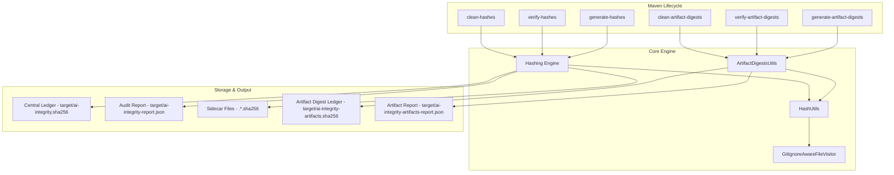

# Project Architecture

The **AI Build Integrity Maven Plugin** is designed as a lightweight, performant, and secure wrapper around a high-speed hashing engine. It integrates directly into the Maven lifecycle to ensure the integrity of AI-assisted development environments.

## Component Overview

## Core Components

### 1. The Mojos (Entry Points)

- **`HashGeneratorMojo`**: Scans the project based on `includes`/`excludes` and generates the cryptographic state.
- **`HashVerifyMojo`**: Re-computes hashes and compares them against the stored ledger. It is the primary "gatekeeper" for CI/CD pipelines.
- **`HashCleanMojo`**: Safe cleanup of generated artifacts, especially in `SIDECAR` mode.

### 2. The Hashing Engine (`HashUtils`)

- Uses **Java NIO** for high-performance file I/O.
- Implements **Streaming Buffers** to handle large files without exhausting RAM.
- **Line Ending Normalization**: Automatically converts CRLF to LF during the hashing stream to ensure cross-platform consistency.
- Supports **SHA-256** (default) and **SHA-512**.

### 3. I/O & Filtering (`GitIgnoreAwareFileVisitor`)

- A custom file visitor that respects `.gitignore` patterns.
- Optimized to prune subtrees early (e.g., `target/`, `.git/`, `node_modules/`) to maintain high throughput.

### 4. Artifact Digest Engine (`ArtifactDigestsUtils`)

- Provides **streaming-only** hash computation for binary artifacts (JARs, WARs, ZIPs).
- Never loads full artifact files into heap memory — critical for large JARs.
- Implements canonical path enforcement to prevent path traversal attacks.
- Validates algorithm availability at runtime and warns on compromised algorithms (MD5, SHA-1).

### 5. Integrity Reporting

- **Central Ledger**: A single source of truth for the entire project.
- **Audit Reports**: JSON-formatted logs designed for ingestion by SIEM systems (Splunk, DataDog, etc.).
- **Sidecar Mode**: Distributed hashes for environments where a central ledger is not ideal.

## Security Design

- **Foundation of Trust**: The plugin assumes the maintainer's environment is trusted during the initial `generate-hashes` phase.
- **Tamper Detection**: Any change to a file's content or line-endings will trigger a mismatch in the `verify` phase.
- **SIEM Pipeline**: By exporting results to a JSON audit report, we enable real-time detection of tampering during the CI build process.

